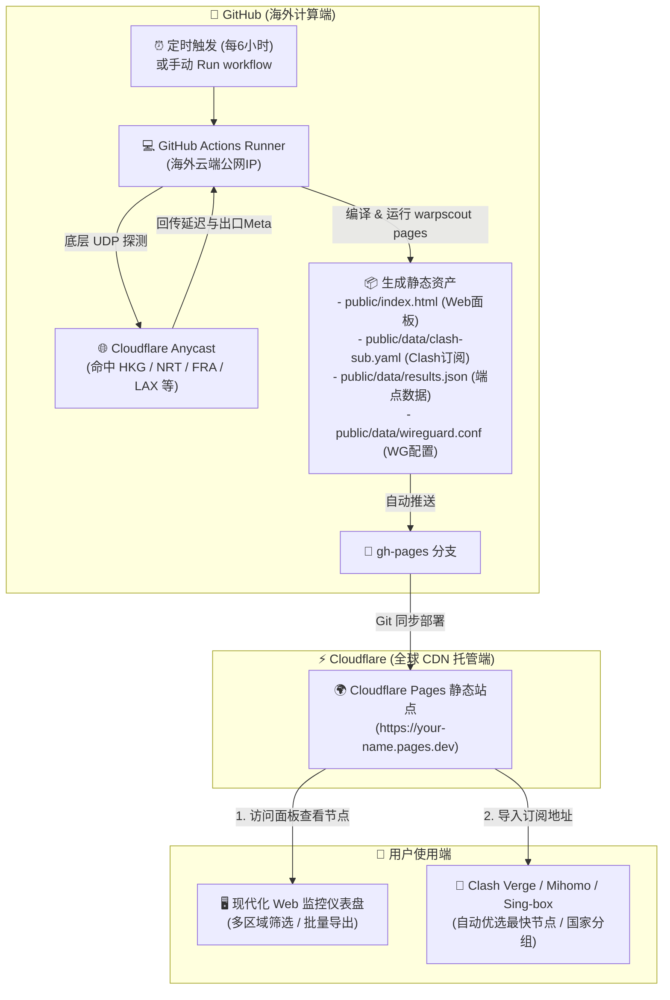

# ⚡ WARPSCOUT Pages：全球 WARP 优选端点自动化探测与订阅面板

> **基于 GitHub Actions（海外节点探测） + Cloudflare Pages（全球 CDN 静态面板托管）的全自动化架构**  
> 彻底解决境内直连 Cloudflare WARP 只能测到美西（US/LAX）节点的问题，自动产出低延迟香港（HKG）、日本（NRT）、新加坡（SIN）、欧洲（FRA）等亚太及全球优选端点，并生成直接可用的 Clash Meta / Mihomo / WireGuard 订阅与静态监控面板。

---

## 📖 目录

- [💡 核心原理与解决痛点](#-核心原理与解决痛点)
- [🔄 协作工作流与数据流向](#-协作工作流与数据流向)
- [🚀 3 步快速接入与配置](#-3-步快速接入与配置)
  - [第 1 步：开启 GitHub Actions 写权限（关键）](#第-1-步开启-github-actions-写权限关键)
  - [第 2 步：手动触发初次扫描以生成 gh-pages 分支](#第-2-步手动触发初次扫描以生成-gh-pages-分支)
  - [第 3 步：在 Cloudflare Pages 绑定仓库](#第-3-步在-cloudflare-pages-绑定仓库)
- [📡 在客户端订阅与使用](#-在客户端订阅与使用)
- [🖥️ 静态面板功能概览](#️-静态面板功能概览)
- [⚙️ 高级配置与自定义探测](#️-高级配置与自定义探测)
- [❓ 常见问题与排错指南 (FAQ)](#-常见问题与排错指南-faq)

---

## 💡 核心原理与解决痛点

### 1. 为什么本地运行优选永远只有美西（US）出口？
- **Anycast 广播路由机制**：Cloudflare WARP 使用 Anycast 全球广播 IP。国内三大运营商（电信/联通/移动）直连该广播 IP 时，底层国际物理路由会直接走跨太平洋海缆直达美西（洛杉矶 LAX / 圣何塞 SJC）。因此在境内直连无论如何优选，出口地区永远是美国。
- **GitHub Actions 的优势**：GitHub Actions 运行在微软 Azure 的海外全球公网数据中心。向 Cloudflare Anycast 发起原始 UDP 握手时，会就近命中香港（HKG）、东京（NRT）、新加坡（SIN）、法兰克福（FRA）等机房，从而获取真实的非美西低延迟亚太及欧洲出口。

### 2. 为什么需要与 Cloudflare Pages 配合？
- **无服务器（Serverless）限制**：Cloudflare Pages / Workers 属于轻量 V8 引擎沙箱，不支持底层 Raw UDP 套接字与高并发 WireGuard 协议栈，无法在 Worker 内直接运行 Go 测速引擎。
- **动静解耦架构**：
  - **计算端（GitHub Actions）**：定时在海外公网环境执行底层 UDP 探测、丢包率测试与出口元数据解析；
  - **展示端（Cloudflare Pages）**：将生成的 `results.json`、`clash-sub.yaml`、`wireguard.conf` 和现代极简暗黑 Web 面板推送到 Cloudflare 全球边缘 CDN，享受 0 冷启动、100% 高可用与免费无限流量。

---

## 🔄 协作工作流与数据流向

整个系统全自动运转，无需任何人工干预或中心服务器：



---

## 🚀 3 步快速接入与配置

只需一次性完成以下配置，后续全自动运行：

### 第 1 步：开启 GitHub Actions 写权限（关键！）

默认情况下 GitHub 限制了 Actions 的写入权限。为了让 Actions 能够自动创建并更新 `gh-pages` 分支，必须开启写权限：

1. 打开你的 GitHub 仓库主页。
2. 点击上方导航栏的 **Settings**（设置）。
3. 在左侧菜单中展开 **Actions** -> 点击 **General**。
4. 向下滚动找到 **Workflow permissions** 区域：
   - 选择 **Read and write permissions**（读取和写入权限）。
5. 点击 **Save**（保存）。

> ⚠️ **注意**：如果不开启该选项，GitHub Actions 在执行推送到 `gh-pages` 分支时会报错 `Permission to ... denied to github-actions[bot]`。

---

### 第 2 步：手动触发初次扫描以生成 gh-pages 分支

为了让 Cloudflare Pages 能够选择到 `gh-pages` 分支，我们需要先让 Actions 运行一次以自动创建该分支：

1. 在 GitHub 仓库页面上方点击 **Actions** 标签页。
2. 在左侧工作流列表中选择 **WARPSCOUT Pages - Scan & Deploy**。
3. 在右侧点击 **Run workflow** 下拉按钮：
   - 保持默认参数（采样 12，协议 awg，超时 3 秒）。
   - 点击绿色的 **Run workflow** 按钮启动任务。
4. 等待约 1~2 分钟，工作流显示绿色勾号完成。
5. 此时回到仓库首页，可以看到分支列表中已经自动生成了 **`gh-pages`** 分支！

---

### 第 3 步：在 Cloudflare Pages 绑定仓库

现在将 Cloudflare Pages 与 GitHub 仓库的 `gh-pages` 分支绑定：

1. 登录 [Cloudflare 控制台 (Dashboard)](https://dash.cloudflare.com/)。
2. 在左侧主菜单中点击 **Workers 和 Pages (Workers & Pages)**。
3. 点击 **创建应用程序 (Create Application)** -> 顶部切换到 **Pages** 选项卡。
4. 点击 **连接到 Git (Connect to Git)**：
   - 如果是第一次使用，根据提示授权 Cloudflare 访问你的 GitHub 账号；
   - 在仓库列表中选择你的本仓库。
5. 配置构建与部署设置（**非常关键，按以下填写**）：
   - **项目名称 (Project name)**：自定义名称（例如 `warpscout`，你的网址将是 `https://warpscout.pages.dev`）。
   - **生产分支 (Production branch)**：选择 **`gh-pages`** （千万别选 main！`gh-pages` 分支内才是构建好的纯静态文件）。
   - **框架预设 (Framework preset)**：选择 **`无 (None)`**。
   - **构建命令 (Build command)**：**留空**（无需在 CF 上构建）。
   - **构建输出目录 (Build output directory)**：**留空** 或填 **`.`**。
6. 点击底部的 **保存并部署 (Save and Deploy)**。

🎉 **配置全部完成！**
Cloudflare Pages 会在数秒内完成部署，并为你分配一个专有的访问域名（如 `https://warpscout.pages.dev`）。
今后无论是 GitHub Actions 按照每 6 小时的计划定时运行，还是你手动触发，每次 Actions 跑完更新 `gh-pages` 分支时，Cloudflare Pages 都会在 1 秒内自动同步并刷新全球 CDN！

---

## 📡 在客户端订阅与使用

### 1. 专属订阅地址
部署完成后，你的订阅地址即为：
```text
https://<你的Pages域名>.pages.dev/data/clash-sub.yaml
```
例如：`https://warpscout.pages.dev/data/clash-sub.yaml`

### 2. 导入到常用客户端
- **Clash Verge Rev / Clash Nyanpasu / Mihomo Party / Flclash**：
  1. 打开客户端配置界面，点击 **新建订阅 (New Profile / Import)**。
  2. 类型选择 **Remote (远程 URL)**。
  3. 粘贴上述订阅链接，设置自动更新时间（建议 6 或 12 小时）。
  4. 点击 **保存并更新**。
- **内置策略组特性**：
  - **`⚡ 自动优选`**：内置 URL-Test 自动测速，每 300 秒自动切换到当前延迟最低、丢包率最小的海外端点。
  - **国家分组**：自动识别出口国家，生成 `🇯🇵 日本节点`、`🇭🇰 香港节点`、`🇸🇬 新加坡节点`、`🇺🇸 美国节点`、`🇪🇺 欧洲节点` 等独立分组。
  - **手动选择**：可直接在单个节点列表中挑选指定机房（如 NRT/HKG/FRA）。

### 3. 直接下载静态配置文件
你的 Pages 站点还公开托管了以下开箱即用的静态资源：
- `https://<域名>/data/clash-sub.yaml`：全量 Clash Meta 订阅文件
- `https://<域名>/data/clash-provider.yaml`：纯 Proxy Provider 格式列表
- `https://<域名>/data/wireguard.conf`：前 20 个最优端点的合并 WireGuard / AmneziaWG 配置文件
- `https://<域名>/data/endpoints.txt`：纯 `IP:Port` 文本列表
- `https://<域名>/data/results.json`：完整的 JSON 探测元数据

---

## 🖥️ 静态面板功能概览

访问你的 Pages 域名根路径 `https://<域名>.pages.dev`，即可打开现代暗黑玻璃拟态面板：

1. **实时指标卡片**：展示可用端点数、最优延迟（最低可达 20~40ms）、当前协议、地区覆盖分布及最后探测时间。
2. **Clash 订阅中心**：
   - 自动生成并展示完整订阅 URL，一键复制；
   - 点击 **“🚀 一键导入到 Clash”** 自动唤起客户端协议 (`clash://install-config`)；
   - 提供各类配置的单键下载。
3. **多国家/地区快速筛选**：
   - 动态标签栏展示：`🌐 全部`、`🇯🇵 日本`、`🇭🇰 香港`、`🇸🇬 新加坡`、`🇪🇺 欧洲`、`🇺🇸 美国` 等，带数量角标。
   - 实时搜索框：支持根据 IP、端口、Colo 机场三字码（如 NRT, HKG, LAX）即时筛选。
4. **多选与批量导出浮动工具栏**：
   - 表格支持单选、全选与反选；
   - 勾选 1 个或多个端点后，底部平滑滑出操作浮窗：
     - 📦 **批量导出 Clash 配置**（合并输出为统一 YAML）
     - 📦 **批量导出 WireGuard 配置**（合并输出为 `.conf`）
     - 📋 **批量复制 IP 列表**
     - 💾 **导出选中端点 JSON**
   - 纯前端 JavaScript 毫秒级生成，不产生任何后端请求。

---

## ⚙️ 高级配置与自定义探测

### 1. 手动自定义参数探测
在 GitHub 仓库页面 -> **Actions** -> **WARPSCOUT Pages - Scan & Deploy** -> **Run workflow**：
- `sample`：每个网段探测采样的 IP 数量（默认 12，增大可发现更多端点，运行时间略微增加）。
- `proto`：探测协议：
  - `awg`（AmneziaWG，推荐，有效防御运营商 QoS 干扰与 DPI 阻断）
  - `wg`（原生 WireGuard 协议）
- `timeout`：探测超时时间（默认 3 秒）。
- `target`：自定义目标网段或 IP（如 `162.159.192.0/24,188.114.96.0/24`，留空则默认覆盖官方所有可用池）。

### 2. 调整自动运行频率
编辑仓库根目录下的 [`.github/workflows/warpscout-pages.yml`](.github/workflows/warpscout-pages.yml)：
```yaml
on:
  schedule:
    # 默认每 6 小时运行一次 (UTC 时间 0, 6, 12, 18 点)
    - cron: '0 */6 * * *'
```
如需调整为每 12 小时一次，改为 `'0 */12 * * *'`；如需每 4 小时一次，改为 `'0 */4 * * *'`。

---

## ❓ 常见问题与排错指南 (FAQ)

### Q1: GitHub Actions 运行时报错 `Permission to ... denied to github-actions[bot]`？
**原因**：GitHub 仓库未给 Actions 开启写入权限。  
**解决**：参考 [第 1 步](#第-1-步开启-github-actions-写权限关键)，进入仓库 Settings -> Actions -> General -> Workflow permissions -> 勾选 **Read and write permissions** 并保存，然后重新运行 workflow 即可。

### Q2: 在 Cloudflare Pages 选择分支时找不到 `gh-pages`？
**原因**：仓库刚创建时只有 `main` 分支，`gh-pages` 分支尚未被生成。  
**解决**：参考 [第 2 步](#第-2-步手动触发初次扫描以生成-gh-pages-分支)，手动在 Actions 页面点击 **Run workflow** 跑完一次后，`gh-pages` 分支就会自动出现。

### Q3: 访问 Cloudflare Pages 页面提示 404 Not Found？
**检查点**：
1. 确认 Cloudflare Pages 绑定的分支是否为 **`gh-pages`**（如果是 main 会 404）；
2. 确认 Cloudflare Pages 设置中的 **构建输出目录 (Build output directory)** 是否填了 `.` 或留空。

### Q4: 导入 Clash 后节点无法握手或延迟显示超时？
**排查建议**：
1. 确认你的 Clash 内核版本是否支持 **AmneziaWG**（建议使用最新的 **Clash Verge Rev** 或 **Mihomo / Clash Meta** 内核）。
2. 如果本地网络对混淆协议有限制，可以在 GitHub Actions 手动触发时将 `proto` 参数切换为 `wg`（原生 WireGuard）再测试。

---

## 📄 开源许可

本项目遵循 MIT 开源许可协议。
